# Adventures of Lolo: Cyberpunk Remaster

> **Next-Gen Grid-Based Cyberpunk Action-Puzzle Engine**  
> Fusing classic top-down Sokoban mechanics with real-time hazard avoidance, 90° optical laser deflection, phase-permeable barriers, multi-directional turrets, procedural Sokoban generation, and an integrated level editor.


---

## 🎮 Game Overview

**Adventures of Lolo: Cyberpunk Remaster** reimagines the timeless 1989 HAL Laboratory classic *Adventures of Lolo* in a sleek neon-lit synthwave aesthetic.

As Operative Lolo, your mission is to navigate through security sectors, outsmart automated killer sentries, manipulate high-tech tactical push-blocks, collect Energy Cores to unlock Data Chests, and conquer 100 handcrafted stages.

### 🔍 Expanded Filter System

The game includes more than the CRT scanline toggle. The procedural lab and editor support layered filter controls for:

- Terrain toggles: meadow grass, dune sand, water canals, cyber trees, portals, mag-lev ice, one-way arrow gates, cracked walls
- Enemy roster filters: select which hostile archetypes are allowed in a generated chamber
- Block roster filters: toggle alloy/heavy/reflector/holo/bomb/magnetic/sticky/fragile/decoy blocks
- Prefab inclusion filters: choose which tactical layouts are eligible for synthesis
- Difficulty and biome selectors: easy/medium/hard, block-density tuning, biome-specific generation
- Visual filters: CRT subtle/heavy/off plus theme presets and HUD overlays

These filters work together to create custom playable chambers while keeping generated levels mathematically solvable.

---

## 📸 Screenshots & Visual Tour

### 1. Main Campaign Gameplay (Stage 1 — Introductory Training Protocol)
*Standard 11×11 grid with Tactical Dossier telemetry, Hazard Scanner, Virtual Gamepad, and real-time canvas rendering.*

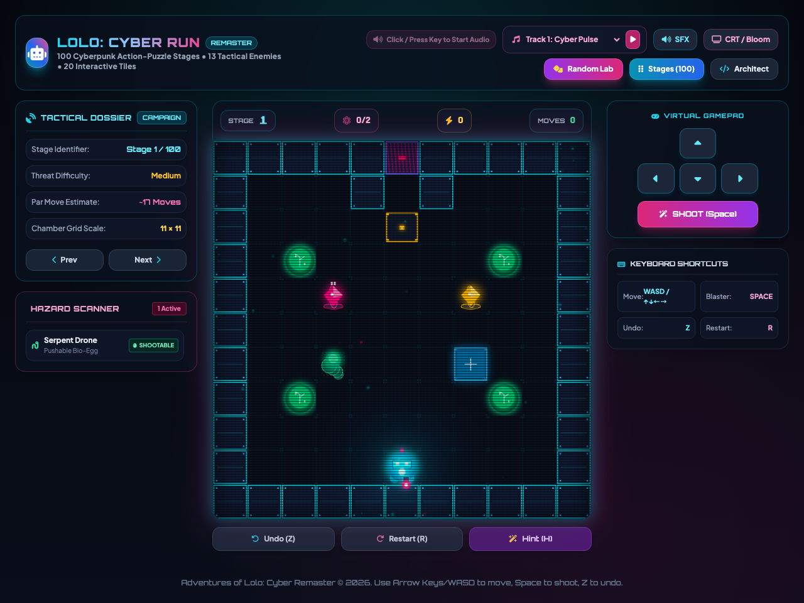

---

### 2. Tactical Mid-Campaign Puzzle (Stage 45 — Prism Deflection Matrix)
*Expanded 13×13 grid featuring Reflector Prisms deflecting line-of-sight laser sentries and multi-directional turrets.*

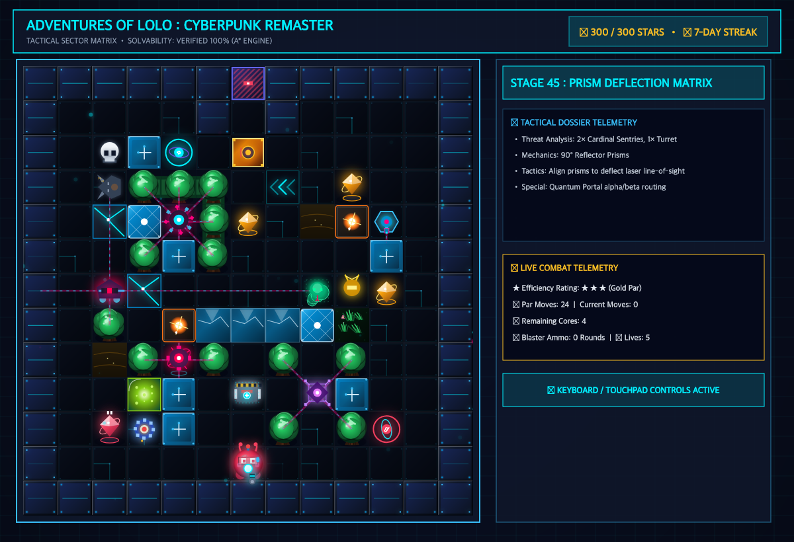

---

### 3. Apex Cyber Fortress (Stage 98 — High-Density Grandmaster Chamber)
*Maximum 19×19 grid featuring dense security corridors, Don Medusa patrols, Quantum Portals, and multi-block Sokoban covers.*

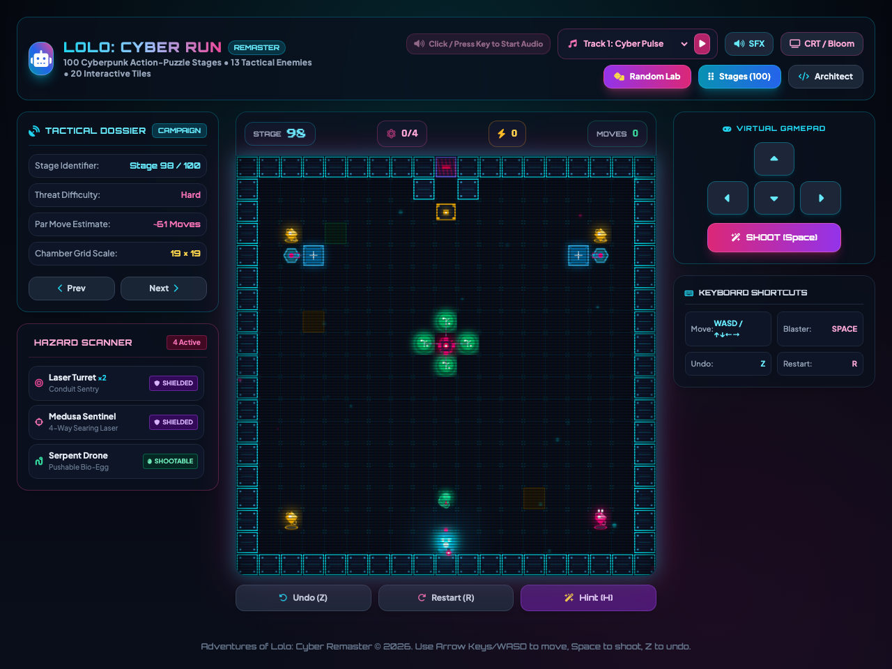

---

### 4. Cyber Architect Studio (Integrated Level Editor)
*Full-featured level editor with symmetry tools, drawing tools (Pencil, Fill, Box, Eraser), tile/block/enemy palettes, live telemetry, A* solver integration, and JSON import/export.*

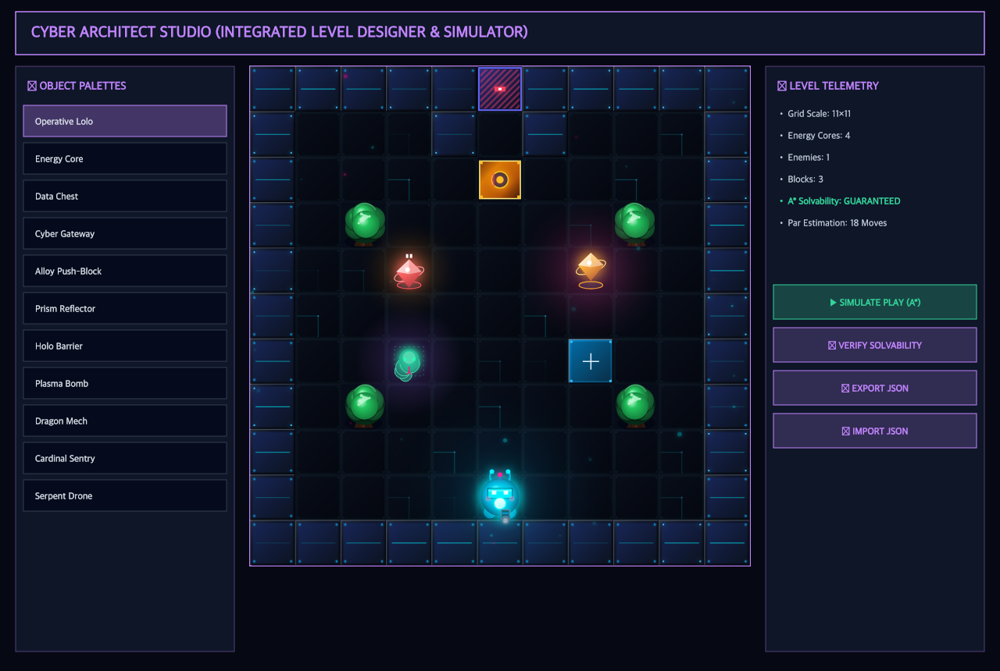

---

### 5. Cyber Protocol Lab (Procedural Sokoban Generator)
*Procedural generator capable of synthesizing 100% mathematically proven solvable Sokoban chambers based on seed, grid size (9×9 to 17×17), difficulty, and hazard filters.*

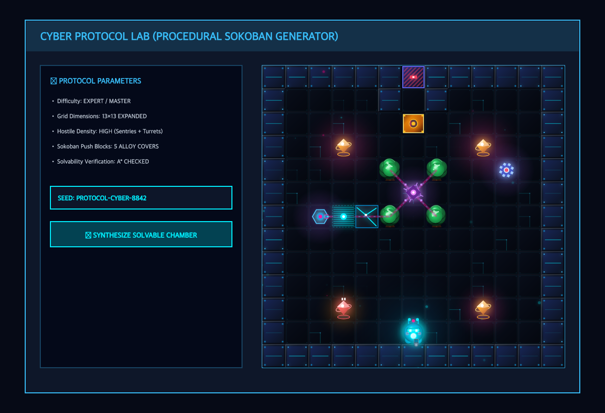

---

### 6. 100-Stage Cyber Vault Matrix
*Interactive stage browser and unlock system covering all 100 handcrafted campaign levels.*

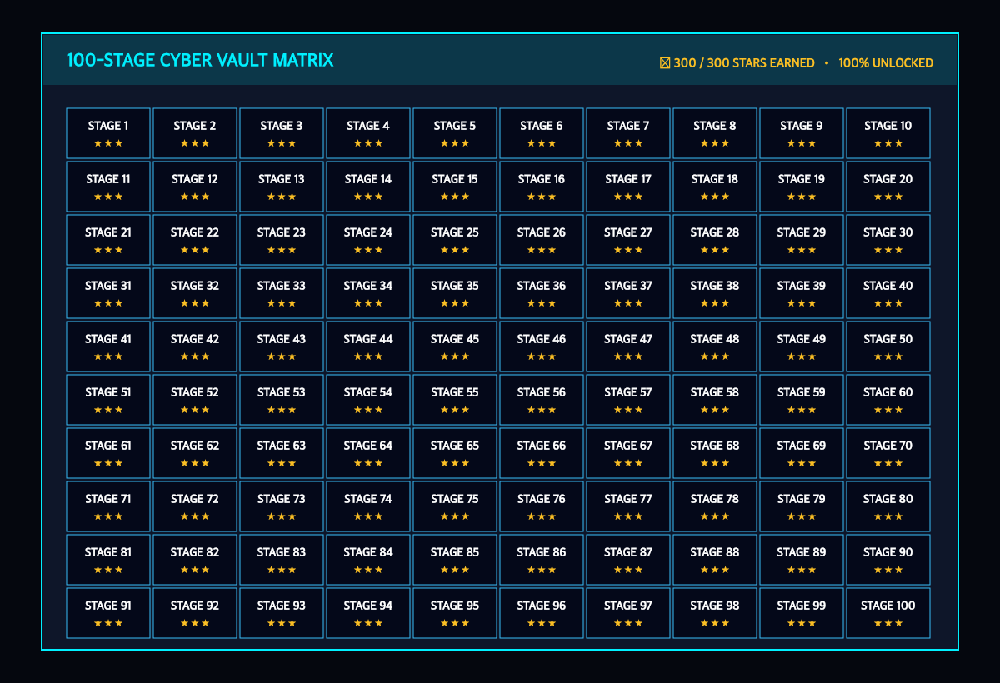

---

## 🔥 Key Features

- **100-Stage Handcrafted Campaign & Progressive Difficulty**:
  - **Dynamic Board Scaling**: Progressively scales grid dimensions ($9\times 9$, $11\times 11$, $13\times 13$, $15\times 15$, $17\times 17$, $19\times 19$) as security sectors increase in threat.
  - **100% Unique & Solvability-Proven**: Every layout is mathematically guaranteed solvable by the built-in $A^*$ solver engine with strict progressive difficulty curve tuning across all 100 stages.

- **16 Hostile Enemy AI Archetypes**:

  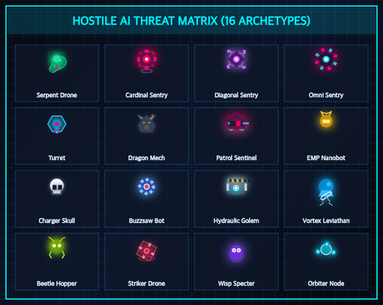

  | Rendered Icon | Name | Threat Profile | Behavior / Mechanics |
  | :---: | :--- | :--- | :--- |
  |  | **Serpent Drone (`snake`)** | Passive | Stationary drone; shootable into a pushable Bio-Egg to bridge water/plasma canals. |
  |  | **Cardinal Sentry (`medusa`)** | High (Kill-on-Sight) | Fires instant line-of-sight laser beams along 4 orthogonal axes (+). Blocked by push-blocks/trees. |
  |  | **Diagonal Sentry (`medusa_diag`)** | High (Kill-on-Sight) | Fires instant line-of-sight laser beams along 4 diagonal axes (✕). |
  |  | **Omni Sentry (`medusa_omni`)** | Extreme (Kill-on-Sight) | Fires 360° laser beams across all 8 directions (★). |
  | 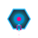 | **Multi-Directional Turret (`turret`)** | Configurable | Emitter firing customizable 1-way to 8-way directional lasers (`1-up`, `2-horiz`, `4-cross`, `8-omni`). |
  |  | **Dragon Mech (`gol`)** | Awakening Hazard | Slumbers until all cores are gathered; shoots lethal fireballs down its line-of-sight when awake. |
  |  | **Patrol Sentinel (`don_medusa`)** | Extreme (Kill-on-Sight) | Patrols continuously along horizontal or vertical tracks while maintaining crossfire lasers. |
  |  | **EMP Nanobot (`leeper`)** | Area Denial | Relentlessly chases Lolo; upon reaching adjacent tile, permanently freezes into an impassable block. |
  |  | **Charger Skull (`skull`)** | Awakening Chaser | Slumbers while cores remain; charges straight at Lolo upon core collection. |
  |  | **Buzzsaw Bot (`alma`)** | Real-Time Chaser | Continuously pathfinds toward Lolo in real time across walkable floor tiles. |
  |  | **Hydraulic Golem (`rocky`)** | Physical Threat | Aggressively charges and physically shoves Lolo backward on contact. |
  |  | **Vortex Leviathan (`moby`)** | Pull Hazard | Emits a tractor vortex across water channels, pulling Lolo into the current. |
  |  | **Beetle Hopper (`hopper`)** | Jumping Chaser | Chases Lolo by leaping over low obstacles, push-blocks, and cyber trees. |
  |  | **Striker Drone (`striker`)** | Sniper Sentry | Fires high-velocity line-of-sight laser projectiles directly across unobstructed corridors. |
  |  | **Phasing Phantom (`wisp`)** | Stealth Threat | Ethereal unit that moves toward Lolo, phasing through push-blocks, crystals, and trees. |
  |  | **Revolving Node (`orbiter`)** | Area Denial | Orbits in continuous circular trajectories around staging anchors with rotating pulse lasers. |

- **9 Tactical Push-Block Archetypes**:

  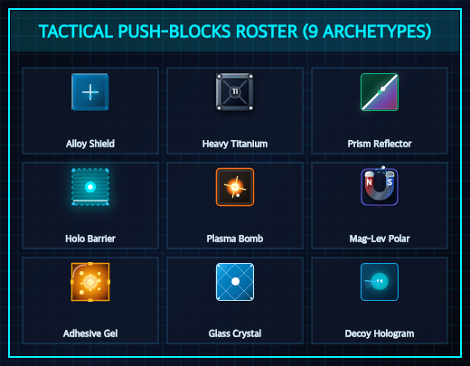

  | Rendered Icon | Name | Classification | Mechanics & Tactical Usage |
  | :---: | :--- | :--- | :--- |
  |  | **Alloy Shield (`alloy`)** | Standard Push Block | Standard 1-tile push block; blocks entity movement & laser beams. |
  | 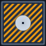 | **Heavy Titanium (`heavy`)** | Heavy Barrier | Immovable heavy barrier; blocks all lasers and unit paths. |
  |  | **Prism Reflector (`reflector`)** | Optical Deflector | Deflects lasers at 90° angles based on 4 mirror orientations ($\nearrow, \searrow, \swarrow, \nwarrow$). |
  | 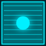 | **Holo Barrier (`holo`)** | Phasing Barrier | Permeable to optical lasers and blaster shots, but physically blocks Lolo and hostiles. |
  |  | **Plasma Bomb (`bomb`)** | Explosive Ordnance | Explodes on shot or damage, detonating a $3\times 3$ area clearing cracked walls, fragile blocks, and hostiles. |
  |  | **Mag-Lev Polar (`magnetic`)** | Frictionless Slider | Glides frictionless on Mag-Lev Ice tracks until colliding with solid barriers. |
  | 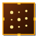 | **Adhesive Gel (`sticky`)** | One-Push Lock | Nanite bonding locks permanently to floor after a single push. |
  |  | **Glass Crystal (`fragile`)** | Shatterable Block | Shatters permanently upon collision, heavy pushes, or blaster impacts. |
  |  | **Decoy Hologram (`decoy`)** | Signal Distractor | Emits an operative hologram signal that redirects enemy aim beams and chaser aggro away from Lolo. |

- **Sector Environment & Interactive Tiles**:

  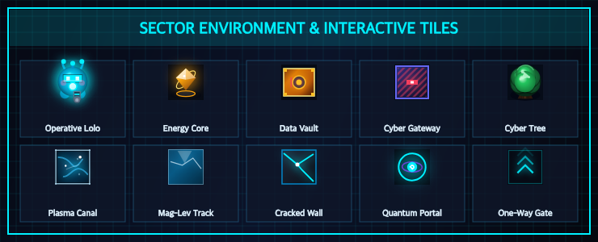

  | Rendered Icon | Name | Sector Functionality |
  | :---: | :--- | :--- |
  |  | **Operative Lolo (`lolo`)** | Player Operative equipped with blaster and tactical suit. |
  |  | **Energy Core (`core`)** | Cybernetic core required to unlock the sector Data Chest. |
  |  | **Data Chest (`chest`)** | Encrypted vault containing sector key; unlocks Cyber Gateway. |
  |  | **Cyber Gateway (`door`)** | Extraction portal to complete sector protocol. |
  |  | **Cyber Tree (`tree`)** | Dense cybernetic tree blocking movement and laser beams. |
  |  | **Plasma Canal (`water`)** | Lethal plasma liquid; requires Bio-Egg bridge to cross. |
  |  | **Mag-Lev Track (`ice`)** | Frictionless superconducting track accelerating objects. |
  |  | **Cracked Wall (`cracked`)** | Fragile security wall breakable via Plasma Bomb detonation. |
  |  | **Quantum Portal (`portal`)** | Pair of quantum wormholes (Alpha/Beta) for instantaneous teleportation. |
  |  | **One-Way Gate (`one_way`)** | Directional security barrier permitting 1-way traversal. |

- **Mathematical A* Solvability & Simulation Engine (`LoloMathSolver`)**:
  - Utilizes a MinHeap Priority Queue with canonical block state serialization to evaluate solution paths across multi-block Sokoban arrangements in under 100 state evaluations ($<1\text{ms}$).
  - **Deterministic Simulation Replay**: Real-time solution simulation in both the **Cyber Architect Level Editor** (`Simulate Play`) and **Random Lab** (`Simulate Path`), executing block pushing, quantum portal teleportation, ice sliding, egg shooting, water rafting, and data vault unlocking with synchronous tape tracking (`.random-tape-badge`).
  - Integrated directly into the gameplay interface via the **Hint (H)** button to assist stuck players.

- **🏰 Mega Grid Matrix & 13 Puzzle Genres (Up to 31×31 Apex Sectors)**:
  - Procedural synthesizer scales seamlessly from compact $9\times 9$ grids all the way up to $31\times 31$ Apex Sectors ($9, 11, 13, 15, 17, 19, 21, 23, 25, 27, 29, 31$).
  - **13 Specialized Puzzle Genres & 32 Chamber Archetypes**: Dynamic Mix, Sokoban, Optics, Portal Maze, Ice Glider, Sentry Gauntlet, Chaser Arena, Swarm Defense, Precision Timing, Fortress Breach, Phase Labyrinth, Decoy Infiltration, and Titan Apex.

- **⚡ Bidirectional Session History Stack (Next & Prev Traversal)**:
  - Full session history tracking (`window.randomSessionHistory` and `window.randomSessionIndex`).
  - Seamlessly step backwards and forwards through previously generated chambers with full matrix and entity fidelity using in-game Prev/Next buttons (`#btn-stage-prev` / `#btn-stage-next`) or modal seed navigators (`#btn-rnd-prev-seed` / `#btn-rnd-next-seed`).

- **Zero-Asset Web Audio API Sound Synthesizer**:
  - Synthesizes 18 dynamic sound effects (laser humming, blaster fire, core pickup, block sliding, bomb detonation, portal warping) and 8 retro synthwave BGM tracks in real-time. Zero external assets required.

- **Cyberpunk AAA Visual Polish**:
  - Dynamic CRT scanline glow overlays, screen shake trauma decay, hit-stop frame freezing, particle bursts, fluid movement lerp, and responsive high-contrast UI.

---

## 🕹️ Controls & Shortcuts

| Action | Primary Key | Alternate Key | Touch / Gamepad |
| :--- | :--- | :--- | :--- |
| **Move Operative** | `W` `A` `S` `D` | `Up` `Left` `Down` `Right` | D-Pad Buttons |
| **Fire Cyber Blaster** | `Space` | — | `SHOOT` Button |
| **Undo Move** | `Z` | `U` | `Undo (Z)` Button |
| **Restart Chamber** | `R` | — | `Restart (R)` Button |
| **Get Solver Hint** | `H` | — | `Hint (H)` Button |
| **Toggle Level Editor** | — | — | `Architect` Header Button |
| **Toggle Stage Vault** | — | — | `Stages (100)` Header Button |
| **Toggle Random Lab** | — | — | `Random Lab` Header Button |

---

## 🚀 Quick Start / How to Run

1. **No Installation Required**: Simply double-click or open `adventures_of_lolo_cyberpunk_remaster.html` in any modern web browser (Google Chrome, Mozilla Firefox, Apple Safari, Microsoft Edge).
2. **Local HTTP Server (Optional)**:
   ```bash
   python3 -m http.server 8000
   # Open http://localhost:8000/adventures_of_lolo_cyberpunk_remaster.html
   ```

### 🔗 Direct URL Query Parameters (Deep Linking)

You can launch directly into specific levels, views, or generated seeds using URL parameters:

- **Launch Stage N (1–100)**: `adventures_of_lolo_cyberpunk_remaster.html?stage=45`
- **Open Level Editor**: `adventures_of_lolo_cyberpunk_remaster.html?view=editor`
- **Open 100-Stage Vault Matrix**: `adventures_of_lolo_cyberpunk_remaster.html?view=levels`
- **Unlock All 100 Stages in Vault**: `adventures_of_lolo_cyberpunk_remaster.html?view=levels&unlock=1`
- **Open Random Generator Lab**: `adventures_of_lolo_cyberpunk_remaster.html?view=random`
- **Load Specific Procedural Seed**: `adventures_of_lolo_cyberpunk_remaster.html?seed=CYBER-7749&diff=hard&grid=15`

---

## 📐 Architecture & Mechanics Matrix

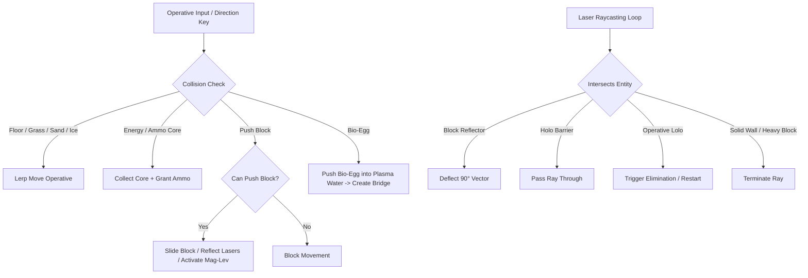

---

## 📜 Technical Stack & Invariants

- **Language & Framework**: Vanilla JavaScript (ES6+), HTML5 Canvas 2D API, Tailwind CSS utilities.
- **Audio Engine**: Web Audio API oscillator synthesis with gain envelopes and high-pass filters.
- **Solver Algorithm**: A* Search with MinHeap priority queue, state canonicalization, and flood-fill reachability analysis.
- **Asset Overhead**: 0 KB external images or audio files (100% self-contained code).

---

## 📄 License & Credits

Distributed under the **MIT License**. See [`LICENSE`](LICENSE) for more information.

*Adventures of Lolo: Cyberpunk Remaster* © 2026. Built with passion for retro Sokoban action-puzzles and cyberpunk aesthetics. Original *Adventures of Lolo* game concept created by HAL Laboratory.
