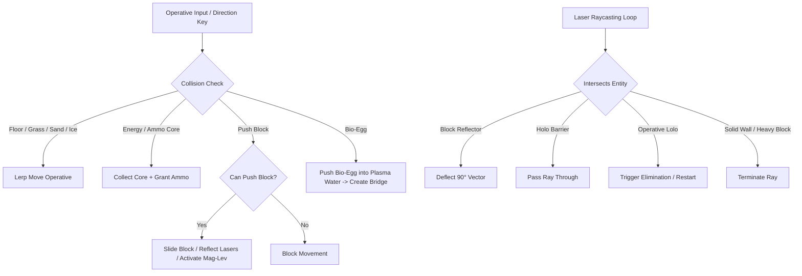

# Adventures of Lolo: Cyberpunk Remaster

> **Next-Gen Grid-Based Cyberpunk Action-Puzzle Engine**  
> Fusing classic top-down Sokoban mechanics with real-time hazard avoidance, 90° optical laser deflection, phase-permeable barriers, multi-directional turrets, procedural Sokoban generation, a Daily Hack Protocol with 7-Day streak calendar, an integrated Level Editor & Chamber Vault, an A* priority queue mathematical solvability engine, dynamic 3-Star performance ratings, multi-theme aesthetics, dynamic tactical sector briefings, and persistent audio save states.


-amber?style=for-the-badge)


---

## 🎮 Game Overview

**Adventures of Lolo: Cyberpunk Remaster** reimagines the timeless 1989 HAL Laboratory classic *Adventures of Lolo* in a sleek neon-lit synthwave aesthetic with modern puzzle depth, procedural generation, daily challenges, and quality-of-life enhancements.

As Operative Lolo, your mission is to navigate through security sectors, outsmart automated killer sentries, manipulate high-tech tactical push-blocks, collect Energy Cores to unlock Data Chests, and extract via the Cyber Gateway.

### 🔍 Random Lab Filters Beyond CRT

The project supports multiple layers of filtering beyond the CRT scanline preset:

- Terrain filters: grass, sand, water, trees, portals, ice, arrow gates, cracked walls
- Enemy filters: toggle which hostile archetypes are allowed in a synthesized chamber
- Block filters: include or exclude alloy, heavy, reflector, holo, bomb, magnetic, sticky, fragile, and decoy blocks
- Prefab filters: enable specific tactical construction patterns and chamber layouts
- Difficulty and density controls: easy/medium/hard, light/heavy/balanced block density, biome-specific generation
- Visual modifiers: CRT, theme palettes, HUD overlays, and post-processing toggles

This makes the Random Lab a true custom-build system rather than a single CRT-only effect toggle.

---

## 📸 Screenshots & Visual Tour

### 1. Main Campaign Gameplay (Stage 1 — Introductory Training Protocol)
*Standard 11×11 grid with Tactical Dossier telemetry, Hazard Scanner, Virtual Gamepad, Live HUD Star Rating, and real-time canvas rendering.*


---

### 2. Tactical Mid-Campaign Puzzle (Stage 45 — Prism Deflection Matrix)
*Expanded 13×13 grid featuring Reflector Prisms deflecting line-of-sight laser sentries and multi-directional turrets.*


---

### 3. Apex Cyber Fortress (Stage 98 — High-Density Grandmaster Chamber)
*Maximum 19×19 grid featuring dense security corridors, Don Medusa patrols, Quantum Portals, and multi-block Sokoban covers.*


---

### 4. Daily Hack Protocol & 7-Day Activity Calendar
*Synchronized 24-hour UTC challenge with live streak tracking, difficulty scaling by day of week, and interactive 7-day replay calendar.*

---

### 5. Cyber Architect Studio (Integrated Level Editor)
*Full-featured level editor with symmetry tools, drawing tools (Pencil, Fill, Box, Eraser), tile/block/enemy palettes, live telemetry, A* solver integration, and JSON import/export.*


---

### 6. Cyber Protocol Lab (Procedural Sokoban Generator)
*Procedural generator capable of synthesizing 100% mathematically proven solvable Sokoban chambers based on seed, grid size (9×9 to 17×17), difficulty, and hazard filters.*


---

### 7. 100-Stage Cyber Vault Matrix with 3-Star Badges
*Interactive stage browser and unlock system covering all 100 handcrafted campaign levels, showing earned star ratings and gold mastery borders.*


---

## 🔥 Key Features

- **⚡ Daily Hack Protocol & 7-Day Streak Calendar**:
  - Synthesizes a brand-new, mathematically guaranteed solvable chamber every 24 hours (UTC) using seed `DAILY-YYYYMMDD`.
  - **Adaptive Grid Scaling**: Weekdays ($11\times 11$), Saturday ($13\times 13$), Sunday ($15\times 15$).
  - **Live Streak Tracking**: Tracks `Current Streak` (🔥), `Best Streak` (⚡), and `Total Cleared` (🏆).
  - **Interactive 7-Day Activity Calendar**: Click any past day in the activity log to replay previous daily protocols.
  - **Custom Aesthetics**: Amber gold glowing border ring, gold particle ripples, and exclusive Daily Protocol trophies.

- **🏆 3-Star Performance Rating System (300 Stars Total)**:
  - Evaluates your move efficiency against the mathematical optimal par move count ($M_{par}$) determined by the $A^*$ solver:
    - **★★★ (Gold Cyber Master)**: Cleared in $\le M_{par} + 2$ moves.
    - **★★☆ (Silver Operative)**: Cleared in $\le \lceil M_{par} \times 1.5 \rceil$ moves.
    - **★☆☆ (Bronze Recon Clear)**: Stage completed.
  - **Live Combat HUD Badge (`#hud-stars`)**: Displays active stage rating (`★ ★ ★` / `☆☆☆`) directly during gameplay.
  - **Header Cumulative Stars Badge (`#header-stars-badge`)**: Displays total campaign stars (`⭐ X / 300`) with real-time sync.
  - **Streamlined Victory Modal**: Displays earned neon stars, player moves vs par moves, elapsed time, and dedicated `NEXT STAGE` / `Replay` actions.

- **📡 Dynamic Stage-by-Stage Tactical Dossiers**:
  - Replaces generic text with **real-time chamber intelligence** on every level (Campaign Stages 1–100, Daily Hack, and Random Lab).
  - Automatically identifies active enemies with quantities (`2× Cardinal Medusa Sentry, 1× Serpent Drone`).
  - Lists environmental mechanics (Alloy Push-Blocks, 90° Optical Laser Prisms, Plasma Waterways, Mag-Lev Ice, Quantum Portals, Plasma Bombs).
  - Formulates actionable puzzle-solving guidance tailored to the active chamber topology.

- **🎨 5 Cyberpunk Color Themes & CRT Overlay Controls**:
  - **Synthwave Cyan**: Default vibrant cyan, magenta & hot pink neon glow.
  - **Matrix Green**: Phosphor green terminal code aesthetic.
  - **Vaporwave Sunset**: Purple, gold & neon rose ambient flow.
  - **Obsidian Dark**: Minimal high-contrast dark slate & sky blue.
  - **Neon Hotline**: Hot pink, violet & cyber gold glow.
  - **CRT Preset Modes**: Toggle between **CRT: Subtle** (90% scanlines), **CRT: Heavy** (100% scanlines), and **CRT: Off**.

- **💾 Full Save State Persistence (`localStorage`)**:
  - **Daily Hack Progress**: Daily streaks, best records, and 7-day calendar activity stamps (`lolo_cyber_daily_v1`).
  - **Audio Settings**: Active BGM track selection (Tracks 1–8), play/pause mute state, and SFX toggle preference.
  - **Theme & VFX Settings**: Selected color theme and CRT overlay preference.
  - **Campaign Records**: Unlocked levels (1–100), stars earned per stage (1–3), personal best moves, and best completion times.

- **🎵 8-Track Web Audio Synthesizer**:
  - 8 switchable procedurally synthesized synthwave tracks (zero external `.mp3` or `.wav` dependencies):
    1. *Cyber Pulse* (128 BPM driving synthwave)
    2. *Quantum Rush* (140 BPM puzzle bounce)
    3. *Synth Chill* (105 BPM atmospheric chill)
    4. *Neon Overdrive* (136 BPM cyberpunk electro)
    5. *Hypergrid Arc* (124 BPM melodic synth)
    6. *Matrix Solace* (110 BPM dark ambient)
    7. *Retro Byte Surge* (145 BPM chip-synth surge)
    8. *Orbital Protocol* (118 BPM progressive sci-fi pulse)
  - 18 synthesized dynamic sound effects (lasers, blaster shots, core chimes, portal warps, crystal shatters, bomb explosions).

- **100-Stage Handcrafted Campaign**:
  - **Dynamic Board Scaling**: Scales grid dimensions ($9\times 9$, $11\times 11$, $13\times 13$, $15\times 15$, $17\times 17$, $19\times 19$) as security sectors increase in threat level.
  - **100% Unique & Solvability-Proven**: Every layout is mathematically guaranteed solvable by the built-in $A^*$ solver engine.

- **13 Hostile Enemy AI Archetypes**:

  

  | Rendered Icon | Name | Threat Profile | Behavior / Mechanics |
  | :---: | :--- | :--- | :--- |
  |  | **Serpent Drone (`snake`)** | Passive | Stationary drone; shootable into a pushable Bio-Egg to bridge water/plasma canals. |
  |  | **Cardinal Sentry (`medusa`)** | High (Kill-on-Sight) | Fires instant line-of-sight laser beams along 4 orthogonal axes (+). Blocked by push-blocks/trees. |
  |  | **Diagonal Sentry (`medusa_diag`)** | High (Kill-on-Sight) | Fires instant line-of-sight laser beams along 4 diagonal axes (✕). |
  |  | **Omni Sentry (`medusa_omni`)** | Extreme (Kill-on-Sight) | Fires 360° laser beams across all 8 directions. |
  |  | **Multi-Directional Turret (`turret`)** | Configurable | Emitter firing customizable 1-way to 8-way directional lasers (`1-up`, `2-horiz`, `4-cross`, `8-omni`). |
  |  | **Dragon Mech (`gol`)** | Awakening Hazard | Slumbers until all cores are gathered; shoots lethal fireballs down its line-of-sight when awake. |
  |  | **Patrol Sentinel (`don_medusa`)** | Extreme (Kill-on-Sight) | Patrols continuously along horizontal or vertical tracks while maintaining crossfire lasers. |
  |  | **EMP Nanobot (`leeper`)** | Area Denial | Relentlessly chases Lolo; upon reaching adjacent tile, permanently freezes into an impassable block. |
  |  | **Charger Skull (`skull`)** | Awakening Chaser | Slumbers while cores remain; charges straight at Lolo upon core collection. |
  |  | **Buzzsaw Bot (`alma`)** | Real-Time Chaser | Continuously pathfinds toward Lolo in real time across walkable floor tiles. |
  |  | **Hydraulic Golem (`rocky`)** | Physical Threat | Aggressively charges and physically shoves Lolo backward on contact. |
  |  | **Vortex Leviathan (`moby`)** | Pull Hazard | Emits a tractor vortex across water channels, pulling Lolo into the current. |
  |  | **Beetle Hopper (`hopper`)** | Jumping Chaser | Chases Lolo by leaping over low obstacles, push-blocks, and cyber trees. |

- **9 Tactical Push-Block Archetypes**:

  

  | Rendered Icon | Name | Classification | Mechanics & Tactical Usage |
  | :---: | :--- | :--- | :--- |
  |  | **Alloy Shield (`alloy`)** | Standard Push Block | Standard 1-tile push block; blocks entity movement & laser beams. |
  |  | **Heavy Titanium (`heavy`)** | Heavy Barrier | Immovable heavy barrier; blocks all lasers and unit paths. |
  |  | **Prism Reflector (`reflector`)** | Optical Deflector | Deflects lasers at 90° angles based on 4 mirror orientations ($\nearrow, \searrow, \swarrow, \nwarrow$). |
  |  | **Holo Barrier (`holo`)** | Phasing Barrier | Permeable to optical lasers and blaster shots, but physically blocks Lolo and hostiles. |
  |  | **Plasma Bomb (`bomb`)** | Explosive Ordnance | Explodes on shot or damage, detonating a $3\times 3$ area clearing cracked walls, fragile blocks, and hostiles. |
  |  | **Mag-Lev Polar (`magnetic`)** | Frictionless Slider | Glides frictionless on Mag-Lev Ice tracks until colliding with solid barriers. |
  |  | **Adhesive Gel (`sticky`)** | One-Push Lock | Nanite bonding locks permanently to floor after a single push. |
  |  | **Glass Crystal (`fragile`)** | Shatterable Block | Shatters permanently upon collision, heavy pushes, or blaster impacts. |
  |  | **Decoy Hologram (`decoy`)** | Signal Distractor | Emits an operative hologram signal that redirects enemy aim beams and chaser aggro away from Lolo. |

- **Sector Environment & Interactive Tiles**:

  

  | Rendered Icon | Name | Sector Functionality |
  | :---: | :--- | :--- |
  |  | **Operative Lolo (`lolo`)** | Player Operative equipped with blaster and tactical suit. |
  |  | **Energy Core (`core`)** | Cybernetic core required to unlock the sector Data Chest. |
  |  | **Data Chest (`chest`)** | Encrypted vault containing sector key; unlocks Cyber Gateway. |
  |  | **Cyber Gateway (`door`)** | Extraction portal to complete sector protocol. |
  |  | **Cyber Tree (`tree`)** | Dense cybernetic tree blocking movement and laser beams. |
  |  | **Plasma Canal (`water`)** | Lethal plasma liquid; requires Bio-Egg bridge to cross. |
  |  | **Mag-Lev Track (`ice`)** | Frictionless superconducting track accelerating objects. |
  |  | **Cracked Wall (`cracked`)** | Fragile security wall breakable via Plasma Bomb detonation. |
  |  | **Quantum Portal (`portal`)** | Pair of quantum wormholes (Alpha/Beta) for instantaneous teleportation. |
  |  | **One-Way Gate (`one_way`)** | Directional security barrier permitting 1-way traversal. |

- **Mathematical A* Solvability & Simulation Engine (`LoloMathSolver`)**:
  - Utilizes a MinHeap Priority Queue with canonical block state serialization to evaluate solution paths across multi-block Sokoban arrangements in under 100 state evaluations ($<1\text{ms}$).
  - **Deterministic Simulation Replay**: Live step-by-step playback in both the **Cyber Architect Level Editor** (`Simulate Play`) and **Random Lab** (`Simulate Path`), physically pushing dynamic blocks, sliding on ice, warping across quantum portals, consuming cores, and opening vaults with synchronous tape badge tracking.
  - Integrated directly into the gameplay interface via the **Hint (H)** button to assist stuck players.

- **Cyber Architect Studio (Level Editor & Simulation Suite)**:
  - Full-featured canvas level editor with Symmetry toggles (Horizontal, Vertical, 4-Way Radial), Pencil, Bucket Fill, Box Select, and Eraser.
  - Object Telemetry dashboard showing block counts, core requirements, hazard density, and built-in Math Check solvability verification.
  - **Live Chamber Simulation**: Replays optimal puzzle solutions in real time with collision physics, portal warps, and automated level state restoration.
  - Local Chamber Vault for saving, loading, and exporting custom levels via JSON format.

- **🏰 Mega Grid Full Hostile Roster Synthesis (17×17)**:
  - Procedural synthesizer guarantees placement of all 13 unique hostile enemy archetypes and tactical blocks across dedicated defensive sectors on Mega grids ($17\times 17$) with 100% verified solvability.

---

## 🕹️ Controls & Shortcuts

| Action | Primary Key | Alternate Key | Touch / Gamepad |
| :--- | :--- | :--- | :--- |
| **Move Operative** | `W` `A` `S` `D` | `Up` `Left` `Down` `Right` | D-Pad Buttons |
| **Fire Cyber Blaster** | `Space` | `X` | `SHOOT` Button |
| **Undo Move** | `Z` | `U` | `Undo (Z)` Button |
| **Restart Chamber** | `R` | — | `Restart (R)` Button |
| **Get Solver Hint** | `H` | — | `Hint (H)` Button |
| **Fast Next Level / Advance** | `Enter` | — | `Next Stage` HUD Button |
| **Confirm Victory / Next Protocol** | `Enter` | `Space` | `NEXT STAGE` Victory Modal Button |
| **Dismiss Briefing / Start** | `Enter` | `Escape` | `Start Mission` Briefing Modal Button |
| **Toggle CRT Preset** | — | — | `CRT: [Preset]` Header Button |
| **Daily Hack Protocol** | — | — | `Daily Hack` Header Button |
| **Toggle Level Editor** | — | — | `Architect` Header Button |
| **Toggle Stage Vault** | — | — | `Stages (100)` Header Button |
| **Toggle Random Lab** | — | — | `Random Lab` Header Button |
| **Trophy Matrix** | — | — | `Trophies` Header Button |

---

## 🚀 Quick Start / How to Run

1. **No Installation Required**: Simply double-click or open `adventures_of_lolo_cyberpunk_remaster.html` in any modern web browser (Google Chrome, Mozilla Firefox, Apple Safari, Microsoft Edge).
2. **Local HTTP Server (Optional)**:
   ```bash
   python3 -m http.server 8000
   # Open http://localhost:8000/adventures_of_lolo_cyberpunk_remaster.html
   ```

### 🔗 Direct URL Query Parameters (Deep Linking)

You can launch directly into specific levels, views, or generated seeds using URL parameters:

- **Launch Stage N (1–100)**: `adventures_of_lolo_cyberpunk_remaster.html?stage=45`
- **Launch Daily Protocol**: `adventures_of_lolo_cyberpunk_remaster.html?view=daily`
- **Open Level Editor**: `adventures_of_lolo_cyberpunk_remaster.html?view=editor`
- **Open 100-Stage Vault Matrix**: `adventures_of_lolo_cyberpunk_remaster.html?view=levels`
- **Unlock All 100 Stages in Vault**: `adventures_of_lolo_cyberpunk_remaster.html?view=levels&unlock=1`
- **Open Random Generator Lab**: `adventures_of_lolo_cyberpunk_remaster.html?view=random`
- **Load Specific Procedural Seed**: `adventures_of_lolo_cyberpunk_remaster.html?seed=CYBER-7749&diff=hard&grid=15`

---

## 📐 Architecture & Mechanics Matrix



---

## 📜 Technical Stack & Invariants

- **Language & Framework**: Vanilla JavaScript (ES6+), HTML5 Canvas 2D API, Tailwind CSS utilities.
- **Audio Engine**: 8-Track Web Audio API oscillator synthesis with gain envelopes and high-pass filters.
- **Solver Algorithm**: A* Search with MinHeap priority queue, state canonicalization, and flood-fill reachability analysis.
- **Save Engine**: High-performance `localStorage` engine persisting star scores, unlocked levels, active audio presets, theme palette, daily streak logs, and CRT modes.
- **Asset Overhead**: 0 KB external images or audio files (100% self-contained code).

---

## 📄 License & Credits

Distributed under the **MIT License**.

*Adventures of Lolo: Cyberpunk Remaster* © 2026. Built with passion for retro Sokoban action-puzzles and cyberpunk aesthetics. Original *Adventures of Lolo* game concept created by HAL Laboratory.
